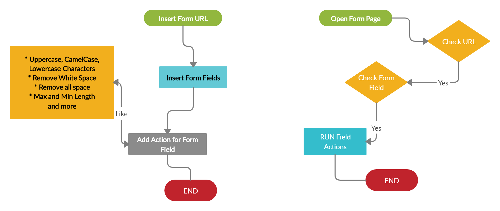

# Form Controller

To upgrade and simplify any html form - Google Chrome Extension

<!--  -->



## Field Actions

| Action Name | Extra Options |
| ----------- | ------------- |
| Default Value | `value` |
| Click |  |
| Convert Kruti Dev Font to Unicode |  |
| Convert Unicode to Kruti Dev Font |  |
| Copy Value For Other Element | `copyElm` |
| Decode Captcha | `apikey, imgElm` |
| Lowercase Characters |  |
| Uppercase Characters |  |
| CamelCase Characters |  |
| Remove Whitespace |  |
| Remove All Space |  |

## Screenshot


## Project setup

```bash
npm run serve
npm run build
```
> Update version number only `package.json` and `manifest.json` file

## Using Libraries

* [Buefy](https://buefy.org/)
* [vue-codemirror](https://github.com/surmon-china/vue-codemirror)
* [Vue.Draggable](https://github.com/SortableJS/Vue.Draggable)

## Browser Support

* Chrome (Latest)

## Changelog

### **`Processing`**

* Max and Min Length, Live Character Counter
* Autocomplete - Month, Random Number, Day, Country, Years

### `V.0.0.1`

* Field Actions
  - Uppercase, CamelCase, Lowercase Characters
  - Remove Whitespace
  - Remove All Space

## Reporting Issues radioactive

If you have a problem with this plugin or found any bug, please open an issue on GitHub.

## Copyright and License copyright

Code copyright 2020 ctechhindi. Code released under the MIT license.